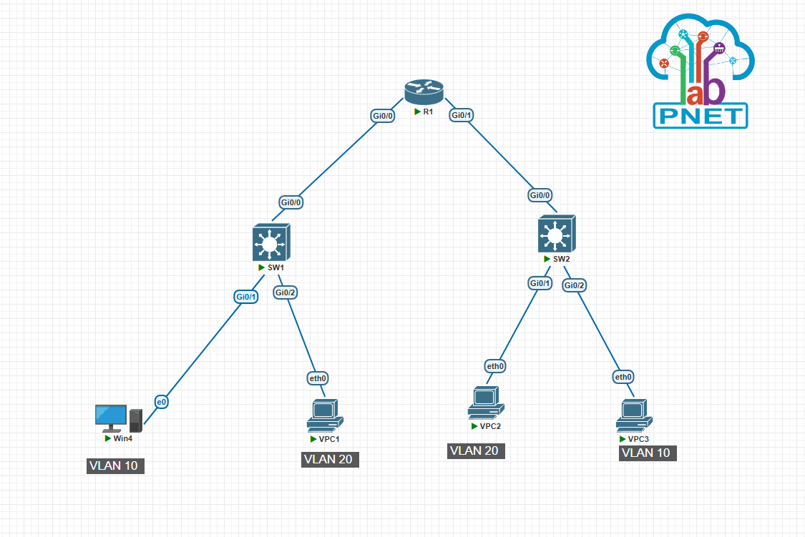

# Small Office Network — Dual RoaS with DHCP

## Overview
A simulated small office network built in PNetLab featuring two separate 
buildings, each with its own Router-on-a-Stick (RoaS) configuration, 
VLANs, and DHCP pools.

## Topology

## Technologies Used
- VLANs (VLAN 10, VLAN 20)
- Router-on-a-Stick (RoaS)
- DHCP (per VLAN)
- Default Route (Loopback simulation)
- PortFast & BPDU Guard

## Addressing Table

| Device | Interface | IP Address | Subnet | VLAN |
|--------|-----------|------------|--------|------|
| R1 | G0/0.10 | 192.168.10.1 | /24 | 10 |
| R1 | G0/0.20 | 192.168.20.1 | /24 | 20 |
| R1 | G0/1.10 | 192.168.100.1 | /24 | 10 |
| R1 | G0/1.20 | 192.168.200.1 | /24 | 20 |
| R1 | Loopback0 | 4.2.2.4 | /32 | — |
| Win4 | e0 | DHCP | /24 | 10 |
| Win5 | e0 | DHCP | /24 | 20 |
| Win6 | e0 | DHCP | /24 | 20 |
| Win7 | e0 | DHCP | /24 | 10 |

## DHCP Pools

| Pool | Network | Gateway |
|------|---------|---------|
| vlan10-1 | 192.168.10.0/24 | 192.168.10.1 |
| vlan20-1 | 192.168.20.0/24 | 192.168.20.1 |
| vlan10-2 | 192.168.100.0/24 | 192.168.100.1 |
| vlan20-2 | 192.168.200.0/24 | 192.168.200.1 |

## What I Learned
- How RoaS works with subinterfaces and dot1Q encapsulation
- How DHCP pools are assigned based on which subinterface receives the request
- Difference between trunk and access ports
- Using a loopback interface to simulate an ISP/internet gateway